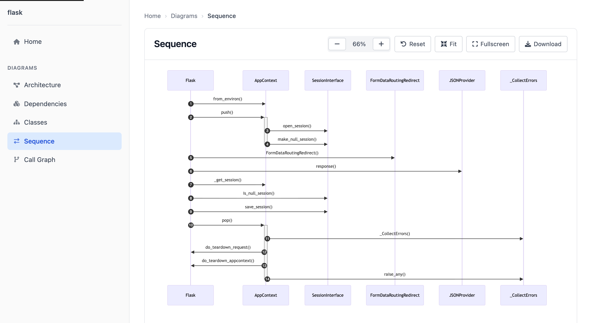
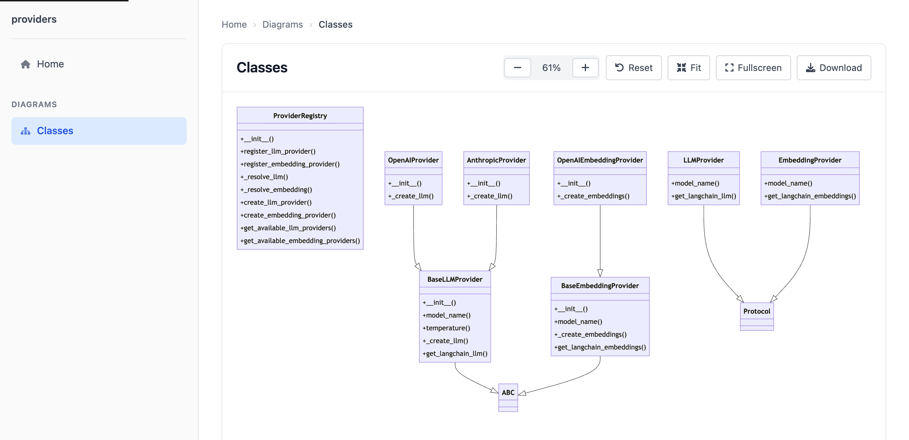
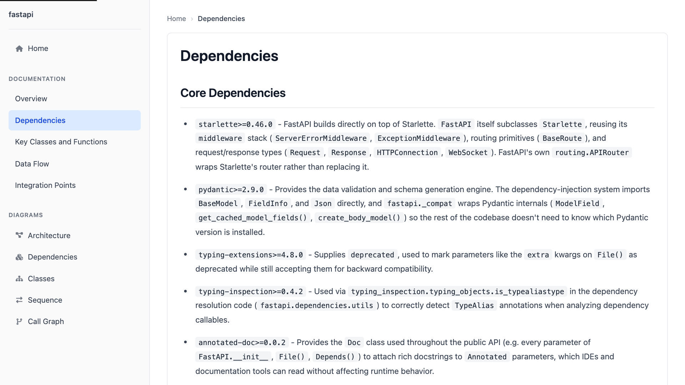
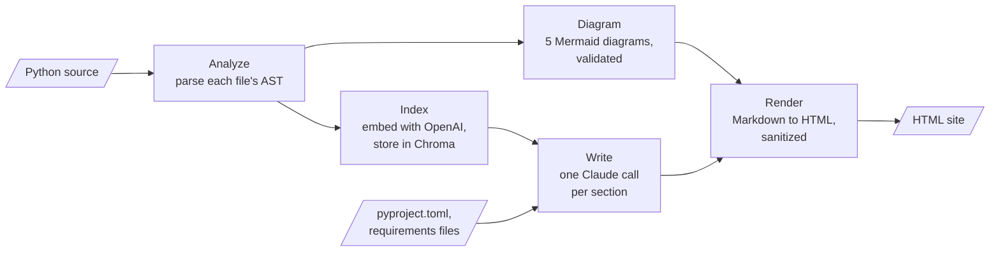

# codeatlas

[](https://github.com/arjunurs/codeatlas/actions/workflows/test.yml)

[](LICENSE)

codeatlas maps a Python codebase and generates browsable HTML documentation for it. It parses
the code with Python's `ast` module, draws Mermaid diagrams of the structure, and uses an LLM with
retrieval over the code (RAG) to write the narrative sections.



*The sequence diagram codeatlas draws for Flask: how `Flask.__call__` handles a request, from
`AppContext.from_environ()` to the teardown calls. Made with `--diagrams-only`, without API keys.*

## Try it without API keys

Diagrams need no API keys and make no LLM calls. With Python 3.10+ and
[uv](https://docs.astral.sh/uv/):

```bash
git clone https://github.com/arjunurs/codeatlas.git
cd codeatlas
uv sync
uv run codeatlas --source . --diagrams-only
```

Then open `output/index.html` in a browser. On this repository it takes a few seconds.
Virtualenvs, `.git`, and build and tool directories are skipped automatically.

## What it generates

**Diagrams** (no API keys needed)

- **Architecture**: the project's modules, grouped by package, and which import which
- **Class**: classes, their methods, and inheritance
- **Dependencies**: which of the project's packages import which, and the third-party
  packages they use (the standard library is left out)
- **Call graph**: calls between the project's own functions, grouped by module (calls to
  built-ins and libraries are left out)
- **Sequence**: the calls between the project's classes, two levels deep, starting from the
  function that reaches the most of its code (for codeatlas, `cli.main`; for Flask,
  `Flask.__call__`, which handles each request)

Each diagram is checked against 10 validation rules (syntax header, quoting, node IDs, edge
syntax, and so on) before it is written. The architecture, dependency, and call graph diagrams
keep their 50 most connected nodes when there are more, and the sequence diagram its first 50
calls. Every diagram is the same from run to run.



*The class diagram for codeatlas's own `providers` package (`--source src/docgen/providers`).*

**Sections** (written by Claude, from code chosen by the project's structure and code
retrieved from a vector store)

- Core: Overview, Dependencies, Key Classes and Functions, Data Flow, Integration Points
- Optional, via `--sections`: Migration Guidance, Code Quality Insights, Cross-Reference
  Documentation

The Dependencies section also reads the project's `pyproject.toml`, `setup.cfg`, and
`requirements*.txt`, so it can name every dependency and version, not only the ones the
retrieved code happens to import.



*The Dependencies section codeatlas wrote for FastAPI's package. Each version is the one in
FastAPI's `pyproject.toml`; what each package is used for comes from the retrieved code.*

## Full documentation (needs API keys)

Sections need an Anthropic API key (for Claude) and an OpenAI API key (for embeddings).

```bash
export ANTHROPIC_API_KEY=...
export OPENAI_API_KEY=...
uv run codeatlas --source ./my_project -o ./docs
```

Or put both keys in a `.env` file and pass it with `--api-key-env .env`. A `.env` file is not
read unless you pass it.

At the end of a run, codeatlas prints the token usage and estimated cost per model. LLM tokens
are the counts the API reports; embedding tokens are estimated from text length, because
LangChain does not expose the embedding API's usage. A first run on FastAPI's package (52 files)
took about 45 seconds and cost about $0.25 with Claude Sonnet 5.

Runs are cached in `.docgen_cache` in the current directory (change it with `--cache-dir`): the
vector store is updated incrementally, and a section is reused while its code, the model, its
prompt, and the retrieval settings are unchanged. A second run with nothing changed takes about a
second and makes no API calls.

## Useful options

| Option | What it does |
|---|---|
| `--source PATH` | Directory to document (required) |
| `-o, --output PATH` | Output directory (default: `output`) |
| `--diagrams-only` | Diagrams only: no LLM calls, no API keys |
| `--dry-run` | Full output with placeholder sections: no API calls |
| `--sections LIST` | Sections to generate, for example `overview,dependencies,code_quality` |
| `--exclude PATTERN` | Glob of files or directories to skip (repeatable) |
| `--quality-mode MODE` | `fast` (Claude Haiku), `balanced` (Claude Sonnet, default), or `best` (Claude Opus) |
| `--force-refresh` | Ignore the cache and regenerate everything |

`uv run codeatlas --help` lists every option, including model selection, diagram selection,
cache control, and retrieval tuning (`--retriever-k`, `--retriever-search-type`).

## How it works



1. **Analyze**: walk the source tree and parse each file's AST into classes, functions, imports,
   and calls.
2. **Diagram**: build Mermaid source for each diagram type and validate it.
3. **Index**: split the code into chunks, embed them with OpenAI, and store them in a local
   Chroma database, with Chroma's anonymized telemetry turned off.
4. **Write**: for each section, take the code its subject calls for from the analysis (the call
   path from the entry point for Data Flow, outlines of the exported classes for Key Classes),
   fill the rest of a fixed budget with relevant chunks, skipping near-duplicates (MMR), and ask
   Claude to write it. Sections run in parallel.
5. **Render**: convert the Markdown to HTML, sanitize it, and render the site with Jinja
   templates.

`--diagrams-only` stops after step 2 and renders the diagrams; `--dry-run` skips steps 3 and 4.
More detail, including caching, measured cost, and failure behavior:
[docs/architecture.md](docs/architecture.md).

## Design decisions

- **Diagrams come from the AST, not the LLM**, so they are deterministic, free, and fast, and
  each one is validated before it is written.
  [More](docs/architecture.md#design-decisions)
- **Chroma runs in-process**: a CLI tool gets a persistent vector store without any service to
  run.
- **Each section gets code chosen from the structure, then retrieved code.** Retrieval alone
  gave Flask's five sections 2 of 48 functions and classes they needed (Data Flow never saw
  `wsgi_app`); choosing the entry point's call path, the exported classes, and the replaceable
  parts from the analysis raised that to 37 of 48 in the same space. Retrieval uses MMR, since
  similarity search filled FastAPI's Overview with near-copies of one block.
  [More](docs/architecture.md#design-decisions)
- **Two cache levels**: embeddings per file, and sections keyed on the code they depend on, the
  model, the exact prompt, and the retrieval settings. [More](docs/architecture.md#caching)
- **Model output is untrusted**: it is sanitized with nh3 before it reaches HTML, and Mermaid
  runs in strict mode.
- **A failed diagram or section does not fail the run**: it is reported, and the rest are still
  generated. [More](docs/architecture.md#failure-behavior)

## Limitations

- Python only.
- Full documentation needs keys from two providers: Anthropic for writing and OpenAI for
  embeddings.
- Section text is LLM output, written from about 20,000 characters of code per section, so it
  can still miss central APIs. Review it before relying on it. See
  [known limits](docs/architecture.md#known-limits).
- On a codebase the size of Flask or FastAPI, the architecture and class diagrams are too dense
  to read at a glance.
- Changing `--temperature` does not invalidate cached sections. Use `--force-refresh` after
  changing it.
- Directories named `build` or `dist` are skipped along with virtualenvs, as ruff does.
- codeatlas is not published on PyPI, and the `codeatlas` name there belongs to an unrelated
  project. Install from GitHub: `pip install git+https://github.com/arjunurs/codeatlas.git`.

The command is `codeatlas`. The Python package is named `docgen`, and `docgen` also works as a
command.

## Development

```bash
uv sync
uv run pre-commit install
uv run pytest
```

There are 600+ unit and integration tests, with about 94% coverage counting branches. CI runs
ruff and ty once and the tests on Python 3.10 to 3.13, and fails if coverage drops below a set
minimum. It also runs the tests against the oldest dependency versions the project allows.
See [CONTRIBUTING.md](CONTRIBUTING.md) for the workflow and code style.

A design proposal for agent-enhanced generation is in
[docs/design/agentic-architecture.md](docs/design/agentic-architecture.md).

## License

MIT. See [LICENSE](LICENSE).
