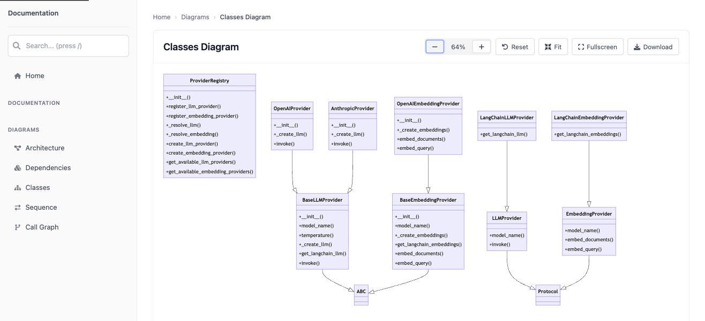

# codeatlas

[](https://github.com/arjunurs/codeatlas/actions/workflows/test.yml)

codeatlas maps a Python codebase and generates browsable HTML documentation for it. It parses
the code with Python's `ast` module, draws Mermaid diagrams of the structure, and uses an LLM with
retrieval over the code (RAG) to write the narrative sections.



*The class diagram codeatlas generates for its own `providers` package.*

## Try it without API keys

Diagrams need no API keys and make no LLM calls. With Python 3.10+ and
[uv](https://docs.astral.sh/uv/):

```bash
git clone https://github.com/arjunurs/codeatlas.git
cd codeatlas
uv sync
uv run codeatlas --source . --diagrams-only
```

Then open `output/index.html` in a browser. On this repository it takes a few seconds.
Virtualenvs, `.git`, and build and tool directories are skipped automatically.

## What it generates

**Diagrams** (no API keys needed)

- **Architecture**: each module and what it imports
- **Class**: classes, their methods, and inheritance
- **Dependencies**: the import graph between packages and the libraries they use
- **Call graph**: which functions call which
- **Sequence**: calls between functions, taken from the call graph (not yet grouped into
  workflows)

Each diagram is checked against 10 validation rules (syntax header, quoting, node IDs, edge
syntax, and so on) before it is written. Large diagrams are cut off at 50 nodes.

**Sections** (written by Claude, using code retrieved from a vector store)

- Core: Overview, Dependencies, Key Classes and Functions, Data Flow, Integration Points
- Optional, via `--sections`: Migration Guidance, Code Quality Insights, Cross-Reference
  Documentation

## Full documentation (needs API keys)

Sections need an Anthropic API key (for Claude) and an OpenAI API key (for embeddings).

```bash
export ANTHROPIC_API_KEY=...
export OPENAI_API_KEY=...
uv run codeatlas --source ./my_project -o ./docs
```

Or put both keys in a `.env` file and pass it with `--api-key-env .env`. A `.env` file is not
read unless you pass it.

At the end of a run, codeatlas prints the token usage and estimated cost per model. LLM tokens
are the counts the API reports; embedding tokens are estimated from text length, because
LangChain does not expose the embedding API's usage.

Runs are cached in `.docgen_cache` in the current directory (change it with `--cache-dir`): the
vector store is updated incrementally, and a section is reused while its code, the model, and its
prompt are unchanged.

## Useful options

| Option | What it does |
|---|---|
| `--source PATH` | Directory to document (required) |
| `-o, --output PATH` | Output directory (default: `output`) |
| `--diagrams-only` | Diagrams only: no LLM calls, no API keys |
| `--dry-run` | Full output with placeholder sections: no API calls |
| `--sections LIST` | Sections to generate, for example `overview,dependencies,code_quality` |
| `--exclude PATTERN` | Glob of files or directories to skip (repeatable) |
| `--quality-mode MODE` | `fast` (Claude Haiku), `balanced` (Claude Sonnet, default), or `best` (Claude Opus) |
| `--force-refresh` | Ignore the cache and regenerate everything |

`uv run codeatlas --help` lists every option, including model selection, diagram selection,
cache control, and retrieval tuning (`--retriever-k`, MMR search).

## How it works

1. **Analyze**: walk the source tree and parse each file's AST into classes, functions, imports,
   and calls.
2. **Diagram**: build Mermaid source for each diagram type and validate it.
3. **Index**: split the code into chunks, embed them with OpenAI, and store them in a local
   Chroma database, with Chroma's anonymized telemetry turned off.
4. **Write**: for each section, retrieve the most relevant chunks and ask Claude to write it.
   Sections run in parallel.
5. **Render**: convert the Markdown to HTML, sanitize it, and render the site with Jinja
   templates.

More detail, including design decisions, caching, measured cost, and failure behavior:
[docs/architecture.md](docs/architecture.md).

## Limitations

- Python only.
- Full documentation needs keys from two providers: Anthropic for writing and OpenAI for
  embeddings.
- Section text is LLM output. Review it before relying on it.
- The cache has known gaps. In a git repository, uncommitted edits (and any edits when `--source`
  is a subdirectory of the repository) are not detected, and changing the `--retriever-*`
  options does not invalidate cached sections. Use `--force-refresh` after such changes.
- The search box in the generated site is not wired up yet.
- Directories named `build` or `dist` are skipped along with virtualenvs, as ruff does.
- codeatlas is not published on PyPI, and the `codeatlas` name there belongs to an unrelated
  project. Install from GitHub: `pip install git+https://github.com/arjunurs/codeatlas.git`.

The command is `codeatlas`. The Python package is named `docgen`, and `docgen` also works as a
command.

## Development

```bash
uv sync
uv run pre-commit install
uv run pytest
```

There are 400+ unit and integration tests, with about 88% coverage counting branches. CI runs
ruff once and the tests on Python 3.10 to 3.13, and fails if coverage drops below a set minimum.
It also runs the tests against the oldest dependency versions the project allows.
See [CONTRIBUTING.md](CONTRIBUTING.md) for the workflow and code style.

A design proposal for agent-enhanced generation is in
[docs/design/agentic-architecture.md](docs/design/agentic-architecture.md).

## License

MIT. See [LICENSE](LICENSE).
