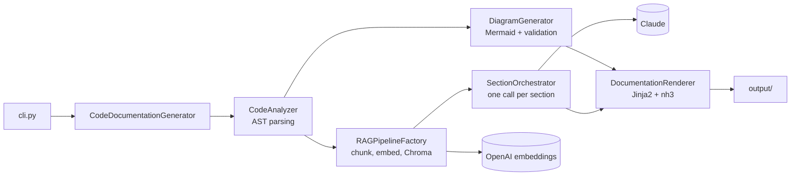
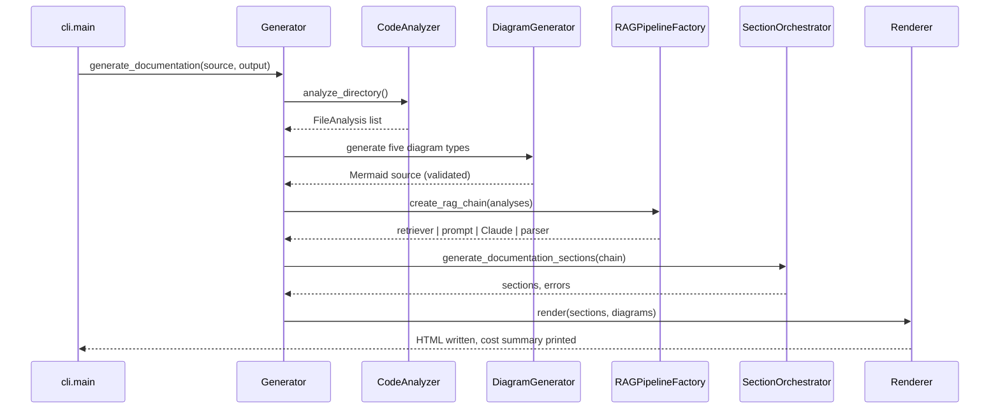

# Architecture

codeatlas turns a Python source tree into a static HTML site: diagrams built from the AST, and
narrative sections written by an LLM over code retrieved from a vector store. This document
covers how a run works, the main design decisions, cost and latency measured on a real
codebase, failure behavior, and known limits.

## Pipeline



| Stage | Module | What it does |
|---|---|---|
| Analyze | `core/analyzer.py` | Walks the tree (skipping virtualenvs, `.git`, build and tool directories), parses each file's AST into classes, functions, imports, and calls |
| Diagram | `core/diagrams.py` | Builds Mermaid source for five diagram types from the analysis, then validates it |
| Index | `core/rag_pipeline.py`, `cache/vector_cache.py` | Splits the code into chunks, embeds them with OpenAI, and stores them in Chroma |
| Write | `core/section_orchestrator.py`, `prompts/` | For each section, retrieves relevant chunks and asks Claude to write it; sections run in parallel |
| Render | `core/renderer.py`, `templates/` | Converts Markdown to HTML, sanitizes it with nh3, and renders the site with Jinja2 |

`--diagrams-only` stops after the diagram stage and needs no API keys. `--dry-run` skips the
index and write stages and renders placeholder sections.

## One run, step by step



## Design decisions

**Diagrams come from the AST, not the LLM.** They are deterministic, free, and fast, which is
what makes `--diagrams-only` useful on its own. Each diagram is checked by 10 validation rules
before it is written; in the default strict mode a diagram that fails is left out and reported
as a warning.

**Chroma as the vector store.** It runs in-process, persists to SQLite, supports similarity and
MMR search, and adds no infrastructure to a CLI tool. FAISS lacks built-in persistence; hosted
stores add a network dependency and cost for no gain at this scale. SQLite is single-writer,
which is fine for one user and would not be for a hosted service.

**Chunking.** Each file produces one document with its full source and one document per class or
function (name, type, docstring, methods, base class). Documents are split into 2,000-character
chunks with 200 characters of overlap. Splitting on AST boundaries would give cleaner chunks and
is a natural next step, since the AST is already available.

**Retrieval.** Each section retrieves 10 chunks by similarity (`--retriever-k`), or by MMR
(`--retriever-search-type mmr`) when a codebase is repetitive and similarity returns
near-duplicates.

**Providers behind a protocol.** `LLMProvider` and `EmbeddingProvider` keep LangChain out of code
that only needs to call a model; the RAG chain uses the extended `LangChain*Provider` protocols.
Anthropic writes and OpenAI embeds by default; `--quality-mode` selects Claude Haiku, Sonnet, or
Opus, and `--anthropic-model` overrides it. Each section call is capped at 8,192 output tokens,
and a section that hits the cap is marked as cut off and not cached.

**Parallel sections with threads.** Section calls are independent and I/O-bound, so a
`ThreadPoolExecutor` with up to 5 workers gives near-linear speedup without making the codebase
async. The cap stays under typical API rate limits.

**Untrusted output is sanitized.** LLM output and error text are cleaned with nh3's allowlist at
render time, diagram code is HTML-escaped, and Mermaid runs with `securityLevel: 'strict'`.

## Caching

```
.docgen_cache/                  # in the current directory, or --cache-dir
└── <sha256(source path)[:16]>/
    ├── chromadb/               # level 1: embeddings
    ├── file_metadata.json      # per-file content hashes and modification times
    └── section_cache.json      # level 2: generated sections
```

- **Level 1, embeddings.** Unchanged files keep their vectors; changed and new files are
  re-embedded and chunks of deleted files are removed.
- **Level 2, sections.** A section is reused while its code dependencies, the model, and its exact
  prompt are unchanged. Sections depend on different parts of the code (Overview on all content,
  Dependencies on imports, Key Classes on entities), so an edit only regenerates the sections it
  affects.
- `--force-refresh` rebuilds the vector store and regenerates every section; `--no-cache` skips
  both levels; `--clear-cache` deletes the project's cache.

Known gaps: in a git repository, change detection only sees committed changes (and none when
`--source` is a subdirectory of the repository), and the section key does not include the RAG
wrapper template or the `--retriever-*` settings.

## Cost and latency

Measured on FastAPI's package (52 files, about 800 KB of source) with the default Sonnet model
and the five core sections:

| Run | Time | Cost | What was called |
|---|---|---|---|
| First run | 43 to 45 s | $0.37 to $0.39 | 5 Claude calls (30,349 input and about 19,000 output tokens) and 6 embedding calls (about 220,000 tokens, estimated) |
| Same run again | 1 s | $0.00 | Nothing: every section and the vector store came from the cache |
| `--diagrams-only` | about 1 s | $0.00 | Nothing |

Section generation dominates both cost and time: embeddings were about 1% of the cost, and the
wall-clock time is set by the slowest of the parallel sections. At the same token counts, Haiku
would cost about $0.13 and Opus about $0.64; real counts differ by model, since models write
different lengths.

The cost summary printed at the end of a run uses the token counts the Anthropic API reports. The
embedding API's usage is not exposed through LangChain, so embedding tokens are estimated from
text length (about 4 characters per token) and labeled as estimates. Prices live in
`utils/cost_tracker.py`.

## Failure behavior

| Failure | What happens |
|---|---|
| A file does not parse | That file is skipped with a warning; analysis continues |
| A diagram fails to generate or validate | It is left out and listed in a warning and on the index page |
| One section fails (rate limit, timeout) | Its page shows the error; other sections are unaffected |
| A section reaches the output limit | It is marked as cut off, a warning is logged, and it is not cached |
| Invalid OpenAI key | The run stops when building the vector store, after diagrams, with exit code 1 |
| Invalid Anthropic key | Every section page shows the error, but the run currently exits 0 |
| Transient API errors | The Anthropic and OpenAI clients retry twice; codeatlas adds no retry of its own |

## Known limits

- **Section quality.** Five agents fact-checked the FastAPI sections against the source: 87% of
  checkable claims were correct and no API was invented, but sections describe only what the 10
  retrieved chunks show. They over-weight whatever was retrieved, miss some central public APIs,
  and the Dependencies section never sees `pyproject.toml`, because only `.py` files are
  indexed. The [agent-enhanced design](design/agentic-architecture.md) proposes adaptive
  retrieval and planning to address this.
- **Diagram noise.** Diagrams are cut off at 50 nodes, and on larger codebases the budget goes to
  standard-library imports and built-in calls. The sequence diagram lists calls from the call
  graph rather than following a workflow.
- **Scale.** All analyses are held in memory, and analysis is single-threaded: analyzing and
  diagramming 7,819 files took 144 s. `--max-files` and `--exclude` bound a run on very large
  trees.
- **Hosting.** Running this as a multi-tenant service would mean a server-based vector store, a
  task queue with per-tenant rate limits for section generation, and retries with backoff. The
  pipeline itself would not need to change.
